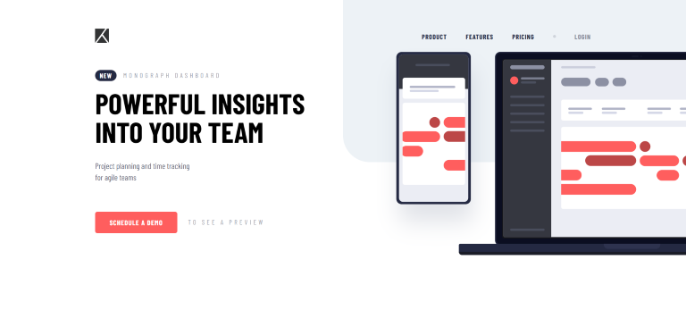

# Frontend Mentor - Project tracking intro component solution

This is a solution to the [Project tracking intro component challenge on Frontend Mentor](https://www.frontendmentor.io/challenges/project-tracking-intro-component-5d289097500fcb331a67d80e). Frontend Mentor challenges help you improve your coding skills by building realistic projects.

## Table of contents

- [Overview](#overview)
  - [The challenge](#the-challenge)
  - [Screenshot](#screenshot)
  - [Links](#links)
- [My process](#my-process)
  - [Built with](#built-with)
  - [What I learned](#what-i-learned)
  - [Continued development](#continued-development)
- [Author](#author)

## Overview

### The challenge

Users should be able to:

- View the optimal layout for the site depending on their device's screen size
- See hover states for all interactive elements on the page
- Create the background shape using code

### Screenshot

### Links

- Solution URL: [Solution](https://github.com/socratesioa/project-tracking)
- Live Site URL: [Live Site](https://socratesioa.github.io/project-tracking)

## My process

### Built with

- Semantic HTML5 markup
- CSS custom properties
- Flexbox
- CSS Grid
- Mobile-first workflow
- JavaScript

### What I learned

Some very good and useful practice on positioning and JS for the mobile menu.

### Continued development

Through constant practice I want to improve on accessibility, workflow and organisation.

## Author

- Website - [My Portfolio](https://portfolio.thisissocrates.com/)
- Frontend Mentor - [@socratesioa](https://www.frontendmentor.io/profile/socratesioa)
